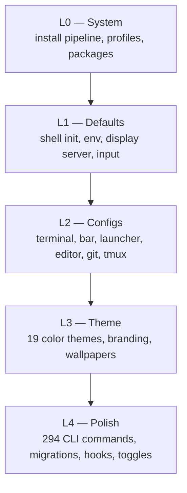
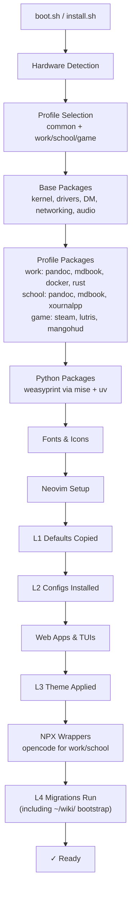
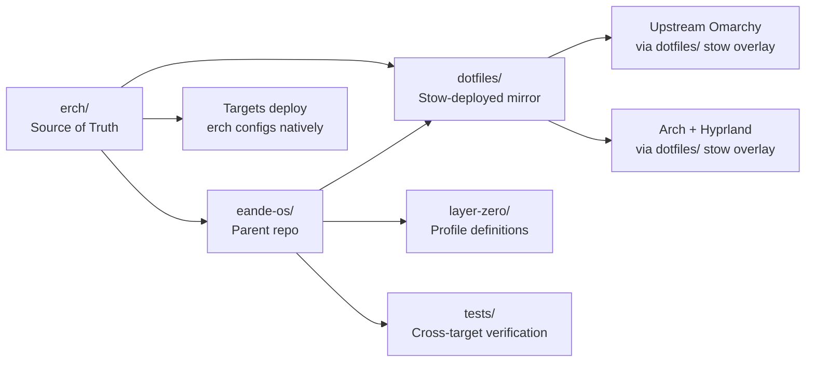
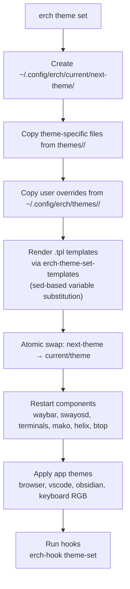
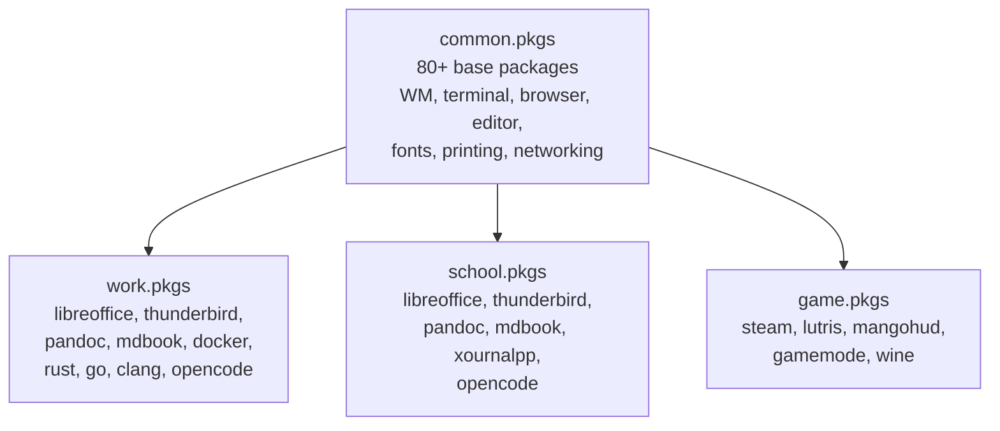
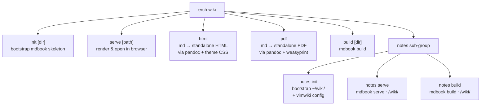

# Architecture

## Layer Model

erch organizes everything into five layers — L0 through L4 — each building on the one below it.

| Layer | Directory | What it contains |
|-------|-----------|-----------------|
| L0 | `install/` | Base packages, profiles, hardware detection, packaging scripts |
| L1 | `default/` | Shell init, env vars, display server, input, fonts, icons |
| L2 | `config/` | App configs (terminal, bar, launcher, editor, git, tmux, etc.) |
| L3 | `themes/` + `default/themed/` | Color schemes, branding, wallpapers, app-specific theme files |
| L4 | `bin/` + `migrations/` + `hooks/` | CLI commands, one-shot migrations, lifecycle hooks |

## Install Flow

## Component Ownership

erch is the source of truth. The parent repo (`eande-os`) mirrors erch's configs for non-erch targets.

| Component | Source of Truth | Mirror | Targets |
|-----------|---------------|--------|---------|
| CLI commands | `erch/bin/` | `dotfiles/home/.local/bin/` (subset) | All targets via stow |
| Config files | `erch/config/` | `dotfiles/home/.config/` | All targets |
| Defaults | `erch/default/` | `dotfiles/home/.local/share/erch/` | erch only |
| Themes | `erch/themes/` | `dotfiles/home/.config/erch/themes/` | erch only (symlinked) |
| Install pipeline | `erch/install/` | Not mirrored | erch only |
| Profiles | `erch/install/packages/` | `layer-zero/` (shared) | All targets |

## Theme System

Template variables available: `{{ background }}`, `{{ foreground }}`, `{{ accent }}`, `{{ cursor }}`, `{{ color0 }}` through `{{ color15 }}`, plus `_strip` (no `#`) and `_rgb` (comma-separated decimal) variants.

## Profile System

## Wiki & Notes System

## Key Design Decisions

1. **erch owns everything.** The parent repo exists only to ship erch's configs to non-erch systems. erch does not depend on the parent repo.
2. **Profiles are additive.** common is always installed. The user picks exactly one of work/school/game at install time. All packages are available post-install regardless.
3. **No commercial deps in defaults.** Users opt in via standard package managers. This keeps erch free and open.
4. **Theme system uses sed, not a real template engine.** Simple, fast, no dependencies. Templates use `{{ variable }}` syntax with three value forms (raw, stripped, RGB).
5. **Configs are read-only in `default/`, writable in `~/.config/`.** The `erch refresh` command resets a config to default with automatic backup.
6. **Branch model isolates risk.** master is stable, rc is release candidate, dev tracks upstream Omarchy with erch-favoring merge strategy. All branches have CI.
7. **294 commands via a single CLI.** Every `erch-*` binary is auto-discovered by the `erch` dispatcher. Metadata in comments drives help text, JSON output, and group organization.
